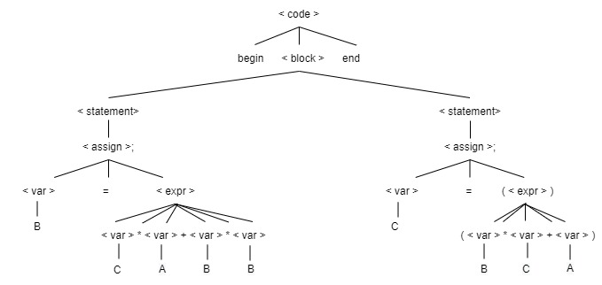

# Create a grammar for small language using BNF that program code that

    
* Starts with the special word begin
* Followed by one or more assignment statement, wherein each statement ends with semicolon(use the BNF for assignment in the example at the parse tree section)
* After the last statement, the code should end with the special word end

    
    >    **< syntax >** -> begin < block > end
    >
    >    **< block >** -> < statement > | < statement >  < statement >
    >
    >   **< statement >** -> < assign >; | < expr >; 
    >
    >   **< assign >** -> < var > = < expr > | < var > = ( < expr > )
    >
    >    **< var >** -> A | B | C
    >
    >   **< expr >** -> < var > < op > < var > < op > < var > < op > < var >  
    >
    >   **< op >** -> + | - | * | /
    

# Derive the statement below and create a parse tree for it:

* begin B = C * A + B * B; C = (B * C + A); end

    ## Derivation

    >< code >   -> begin < block> end
    >
    >           -> begin < statement > < statement > end                                                     
    >           -> begin < assign >; < statement > end 
    >           -> begin < var > = < expr >; < statement > end                                  
    >           -> begin B = < expr >; < statement > end                   
    >           -> begin B = < var > < op > < var > < op > < var > < op > < var >; < statement > end
    >           -> begin B = C * < var > + < var > * < var >; < statement > end
    >           -> begin B = C * A + < var > * < var >; < statement > end
    >           -> begin B = C * A + B * < var >; < statement > end
    >           -> begin B = C * A + B * B; < statement > end
    >           -> begin B = C * A + B * B; < assign >; end
    >           -> begin B = C * A + B * B; < var > = ( < expr > ); end
    >           -> begin B = C * A + B * B; C = ( < expr > ); end
    >           -> begin B = C * A + B * B; C = ( < var > < op > < var > < op > < var > ); end
    >           -> begin B = C * A + B * B; C = ( B * < var > + < var > ); end
    >           -> begin B = C * A + B * B; C = ( B * C + < var > ); end
    >           -> begin B = C * A + B * B; C = ( B * C + A ); end

    ## Parse tree

    

